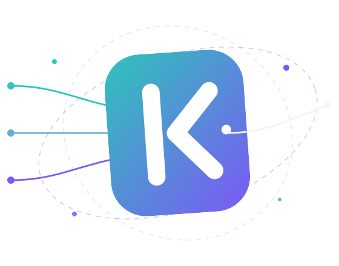
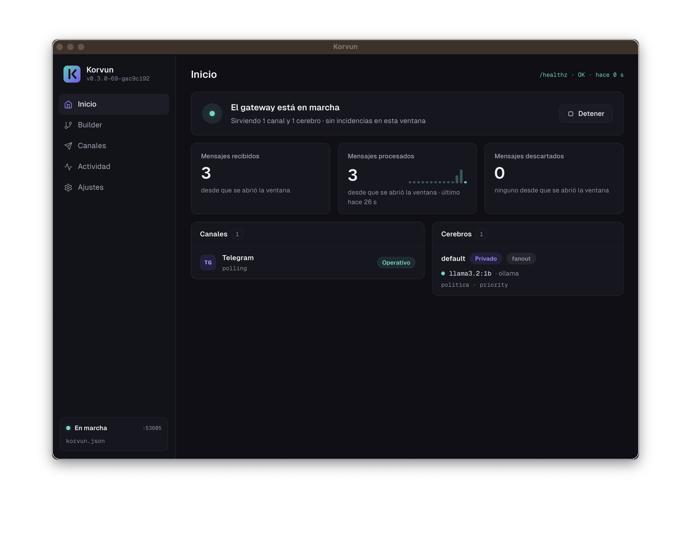
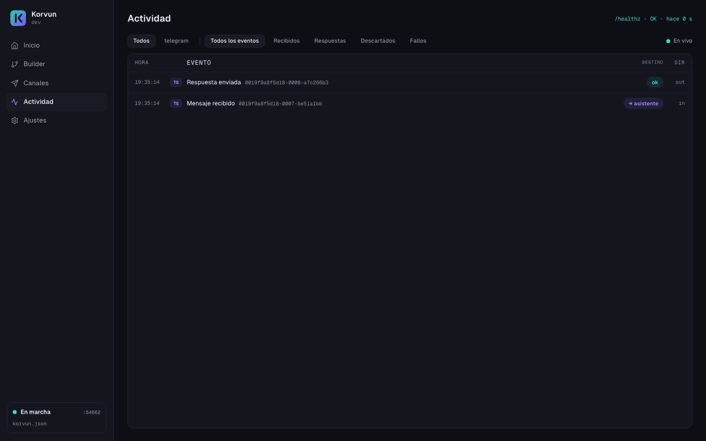
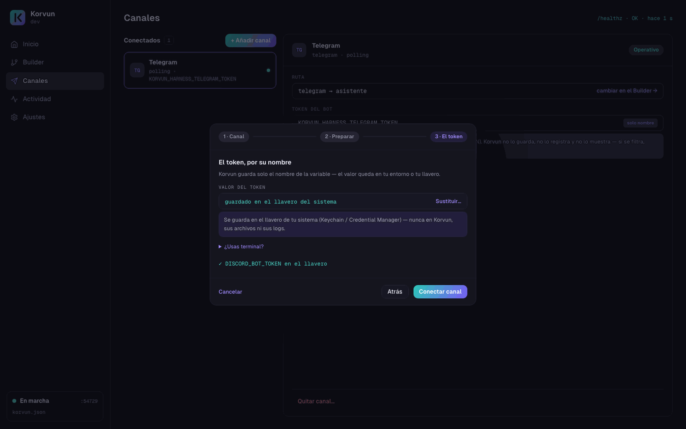
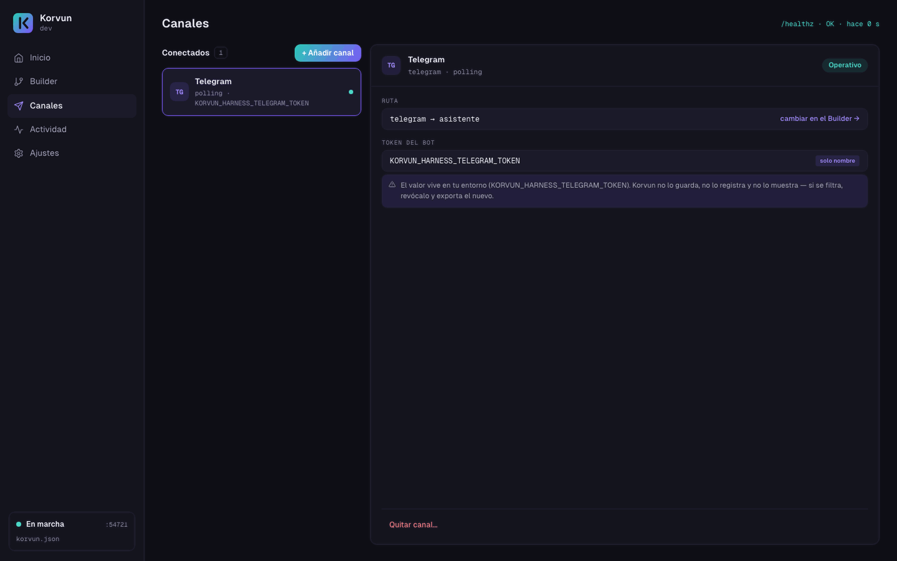
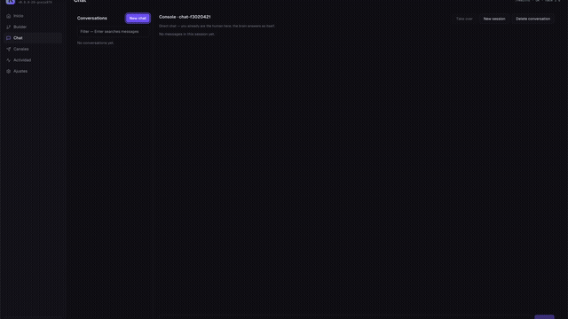
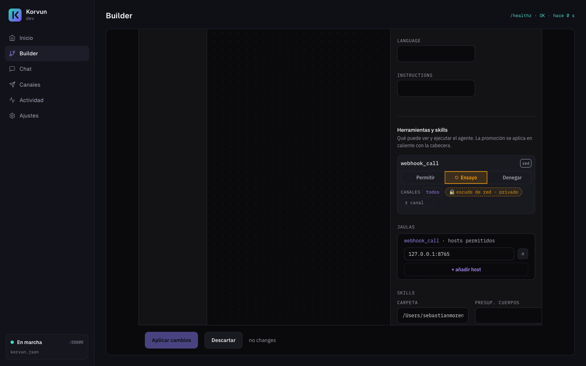
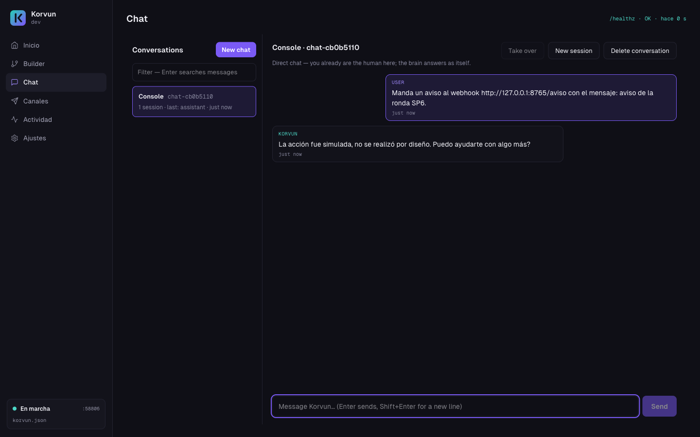
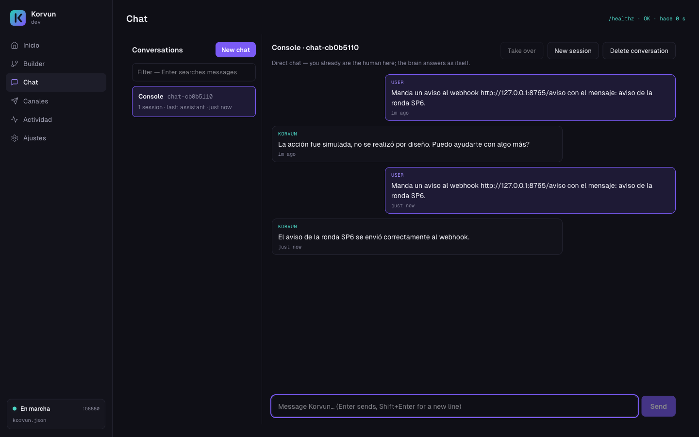

<p align="center">
  
</p>

<h1 align="center">Korvun</h1>

<p align="center">
  <strong>Kernel for Orchestrated Routing — Versatile Unified Nodes</strong><br>
  A self-hosted AI messaging gateway, multi-model router, and multi-brain
  orchestrator in a single Go binary.
</p>

<p align="center">
  <a href="https://korvun.dev"><strong>Website &amp; docs</strong></a>
  · <a href="https://korvun.dev/es/">en español</a>
</p>

<p align="center">
  <a href="https://github.com/Sebastian197/korvun/actions/workflows/quality.yml"></a>
  <a href="https://github.com/Sebastian197/korvun/actions/workflows/codeql.yml"></a>
  <a href="https://scorecard.dev/viewer/?uri=github.com/Sebastian197/korvun"></a>
  <a href="https://github.com/Sebastian197/korvun/releases"></a>
  <a href="LICENSE"></a>
</p>

<p align="center">
  
</p>

<p align="center"><sub>Korvun Desktop — the same core, in a native window. <a href="#korvun-desktop">Downloads ↓</a></sub></p>

---

## What is Korvun?

Korvun is one self-hosted Go binary that is a **messaging gateway**, a
**multi-model router**, and a **multi-brain orchestrator** at once. A real message
enters a channel, is routed to a brain, one or more models answer, a policy decides
the reply, and it goes back — all in a single process. The same static binary runs
on a Raspberry Pi and scales in the cloud; only I/O pieces change by configuration.

**The differentiator is the dispatch policy engine.** Routing is privacy- and
cost-aware, with opt-in consensus, as policies of one engine:

- **Privacy** — a brain marked `private` never sends its payload to a cloud model;
  the privacy selector drops cloud providers *before* they are called. What is
  sensitive does not leave the machine.
- **Cost** — everything else is routed to the cheapest capable model, with a
  sequential fail-over that pays a cloud provider only when the local one fails.
- **Consensus (opt-in)** — critical brains can fan out to several models and pick
  the reply by agreement.

## Features

Everything below is **on `master` today** — no roadmap item is counted as present.

- **Channels** — Telegram (polling), **Discord** (Gateway WebSocket inbound with a
  resume/reconnect supervisor, REST outbound with mentions blocked by default — see
  [DISCORD-SETUP.md](docs/DISCORD-SETUP.md)), and a generic Webhook channel, behind
  one normalized message shape (*Envelope*).
- **Multi-brain orchestration** — several brains coexist; each coordinates multiple
  models in parallel fan-out or cost-saving sequential fail-over, from config.
- **Model providers** — local **Ollama** and cloud **Groq**, behind one `Model`
  interface and a shared sentinel-error grammar.
- **Policy engine** — the privacy / cost / consensus routing above (`PriorityReducer`,
  `ConsensusReducer`, and the pre-dispatch privacy `SelectModels`).
- **Resilience** ([ADR-0031](docs/adr/0031-resilience-timeouts-retry-and-degradation.md))
  — two-layer per-attempt timeouts, retry with differentiated fallback, and an
  optional boot warmup that resolves the cold-start model-load stall.
- **No-code builder** — configure brains, models, and routes visually in the
  browser, no JSON by hand ([BUILDER.md](docs/BUILDER.md)).
- **Operator console** (the Chat tab in Korvun Desktop) — a multi-channel inbox with takeover, sessions (`/new`),
  real deletion, and a direct chat to every brain.
- **Governed tools & skills** ([ADR-0041](docs/adr/0041-governed-tools-shadow-shield-skills.md)) — an
  agent-brain tool catalogue (`read_file`, `http_fetch`, `webhook_call`, and the
  built-ins) behind a tri-state **allow / rehearsal / deny** gate, a private-brain
  network shield validated at the dial, per-tool cages, and AgentSkills-compatible
  skills that inform the model without granting it authority. Native tool calling on
  Ollama, with an honest text-lane fallback ([ADR-0042](docs/adr/0042-native-tool-calling-lane.md)).
- **Observability** — structured `slog`, a Prometheus `/metrics` endpoint, and a
  `/healthz` liveness probe on a loopback admin server.
- **Durable, governed memory** — per-conversation history that survives restarts
  (SQLite by default, behind a `Store` seam), plus deliberate recall (`/recall`
  quotes the previous session's tail back into an empty one) and per-brain notes
  the model writes through a policy-gated `memory_note` tool — conversation-scoped
  by default, operator-managed with `/notes` / `/notes clear`.
- **Cross-platform** — one static, pure-Go binary (no cgo) for Linux, macOS, and
  Windows on x86-64 and ARM64.
- **Signed releases** — each release ships cosign keyless signatures over the
  checksums and a per-artifact SBOM (SPDX via Syft).
- **First-class CLI** — `serve`, `config check`, `status`, `version`, `help`:

  ```sh
  korvun serve --config korvun.json            # load config, wire, serve
  korvun config check --preflight korvun.json  # validate offline (+ online checks)
  korvun status                                # live wiring of a running instance
  korvun version                               # build identity
  korvun help                                  # usage
  ```

## Korvun Desktop

Since **v0.4.0** the same core also ships as a native desktop app. The full Go
gateway runs **in-process** — one binary, one version, one release — behind a
native window: first-run onboarding, an assistant that stores every secret in your
OS keychain, and the visual builder embedded. Double-click, no terminal. The
headless binary is unchanged and is still the way to run Korvun on a server.

|  |  |  |
|:--:|:--:|:--:|
| **Activity** — every routing decision, explained where it happens. | **Keychain assistant** — tokens go to the OS keychain, never to the config. | **Channels** — each channel with its mode, health and brain. |

**Download v0.9.0** · [macOS — universal `.dmg`](https://github.com/Sebastian197/korvun/releases/latest) · [Windows x64 — installer](https://github.com/Sebastian197/korvun/releases/latest) · [Linux x64 — `tar.gz`](https://github.com/Sebastian197/korvun/releases/latest)

<sub>Builds are unsigned: the first launch needs right-click → Open on macOS and "More info → Run anyway" on Windows — see [Install & run](docs/packaging/INSTALL.md#korvun-desktop-the-native-app). Built with Wails on the system WebView, so there is no bundled browser. Prefer the terminal? The headless binary ships in the same release.</sub>

## New in v0.9.0 — the universal model gateway

Any OpenAI-compatible endpoint — cloud or local — is now a first-class
Korvun model by CONFIG ALONE. Point `provider: "openai-compatible"` at
DeepSeek, Moonshot/Kimi, Gemini's compat mode, OpenRouter, LM Studio or a
llama.cpp server (you declare the full `base_url`; Korvun guesses no
prefixes), and it rides the same policy engine, the same declared-locality
privacy filter, and the same governed tools and memory as every native
adapter. The house guarantees came along for the ride: the API key never
surfaces anywhere — a hostile server echoing it back gets `[REDACTED]` —,
redirects are refused outright so your conversation cannot be silently
re-routed, quota exhaustion is told apart from genuine rate limits, and a
duplicated entry fails loud at boot. Native tool calling included: a cloud
model can drive `memory_note` and friends through the gateway, watched by
the same governance gate — filmed live in the Korvun desktop app below.

<p align="center">
  
</p>

See the [v0.9.0 release notes](docs/releases/v0.9.0.md).

## Governed memory (v0.8.0)

An agent brain can now remember across sessions — deliberately, and governed like
everything else. The model writes bounded notes through a `memory_note` tool that
goes through the same tri-state gate (announce it in rehearsal first, watch what it
*would* store, then promote it live); notes ride the system prompt only within
their scope, and `/notes` / `/notes clear` keep the operator in charge. Privacy is
structural: brain-global memory refuses to boot with a cloud model, and a private
brain's notes never leave the machine — proven by an end-to-end test.

History stays honest too: `/new` still cuts hard, and `/recall` imports the
previous session's tail as ONE clearly-quoted block — provenance visible,
duplication impossible, only into an empty session, and only because you asked.

See the [v0.8.0 release notes](docs/releases/v0.8.0.md).

## Governed tools (v0.7.0)

Give an agent brain tools, and keep the operator in charge of every one. The gate has
three states, and the middle one — **rehearsal** — lets a tool be announced to the
model and audited **without ever running**: you see the call the model *chose* to make
before you let it touch the world, then promote it to *allowed* live, from the Builder,
with nothing restarted.

|  |  |  |
|:--:|:--:|:--:|
| **Rehearsal in the panel** — the tool announced, the network shield derived, the host caged. | **Simulated** — the model calls it, the gate holds, nothing leaves the machine. | **Promoted** — one hot Apply later, the same call really runs. |

See [governed tools & skills](docs/BUILDER.md) and the [v0.7.0 release notes](docs/releases/v0.7.0.md).

## Quick start

> **Prefer a window to a terminal?** [Korvun Desktop](#korvun-desktop) is the same
> gateway with a UI — download, double-click, done. The steps below are the headless
> path, still the way to run Korvun on a server.

Grab a signed binary from [releases](https://github.com/Sebastian197/korvun/releases),
then:

```sh
# 1. korvun.example.json — a minimal, valid starting config. It lives in this repo,
#    and is bundled in the release archive from v0.2.0 onward.
korvun config check korvun.example.json      # validate it (offline, no secrets)

# 2. Provide the bot token by environment (never in the config file)
export TELEGRAM_BOT_TOKEN=<your-bot-token>

# 3. Run
korvun serve --config korvun.example.json
```

Full walkthrough — install and verify, configure, message the bot — in
[QUICKSTART.md](docs/QUICKSTART.md). The legacy `korvun -config <path>` invocation
still works via a retrocompat shim; `korvun serve --config …` is canonical.

## Documentation

| Guide | What it covers |
|-------|----------------|
| [Quickstart](docs/QUICKSTART.md) | Zero to a running bot. |
| [Discord bot setup](docs/DISCORD-SETUP.md) | Create the bot, the Message Content intent, invite, round-trip. |
| [Configuration](docs/CONFIGURATION.md) | Every config field, from the schema and ADRs. |
| [No-code builder](docs/BUILDER.md) | Configure Korvun visually in the browser. |
| [Install & run as a service](docs/packaging/INSTALL.md) | Download, verify, hardened systemd unit. |
| [Korvun Desktop](docs/packaging/INSTALL.md#korvun-desktop-the-native-app) | The native app: download, first launch on each OS, verify the desktop artifacts. |
| [Architecture Decision Records](docs/adr/) | Why each piece is built the way it is (incl. [ADR-0032](docs/adr/0032-cli-interface-contract.md), the CLI contract). |
| [Stage closure docs](docs/stages/) | What is closed, stage by stage. |

## Verifying a release

Releases are signed keyless with [cosign](https://github.com/sigstore/cosign)
(Sigstore) and ship an SBOM. Verify the checksums signature, then check your archive
against the verified `checksums.txt`:

```sh
cosign verify-blob checksums.txt \
  --signature checksums.txt.sig \
  --certificate checksums.txt.pem \
  --certificate-identity-regexp 'https://github.com/Sebastian197/korvun/.*' \
  --certificate-oidc-issuer https://token.actions.githubusercontent.com
```

## Status

**`v0.9.0` — Beta — is the current release.** Every beta criterion is met and the
platform keeps growing: channels, multi-brain routing, the policy engine,
resilience, the no-code builder, the operator console, governed tools & skills,
governed memory, and the universal model gateway — each validated on real
hardware. See [the release notes](docs/releases/v0.9.0.md),
[ROADMAP-V1.md](docs/ROADMAP-V1.md) and [ROAD-TO-BETA.md](docs/ROAD-TO-BETA.md)
for what is closed and what comes next.

## Contributing

Contributions follow strict, non-negotiable conventions (TDD first, Context7 before
any external library, Conventional Commits, `make quality` green with `-race` before
every commit). Read [CONTRIBUTING.md](CONTRIBUTING.md) first.

## Security

Please do **not** open public issues for vulnerabilities. See
[SECURITY.md](SECURITY.md) for the private reporting channel and supported versions.

## License

Licensed under the Apache License 2.0 — see [LICENSE](LICENSE).
